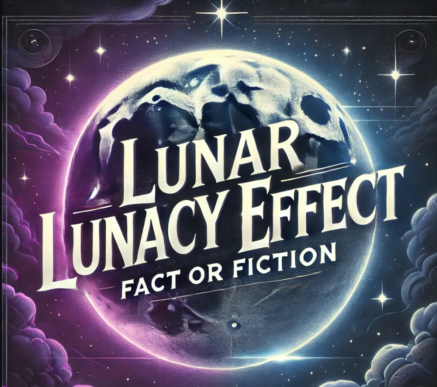
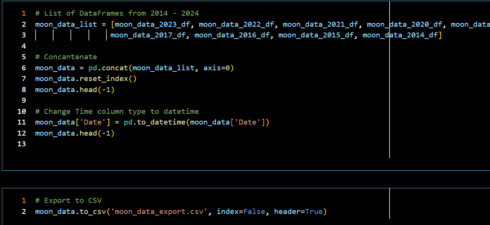
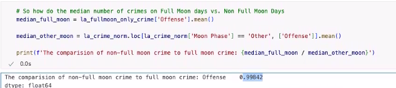
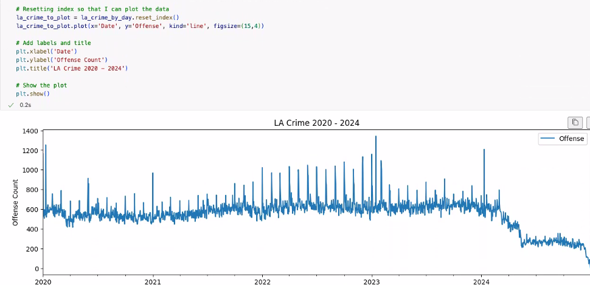
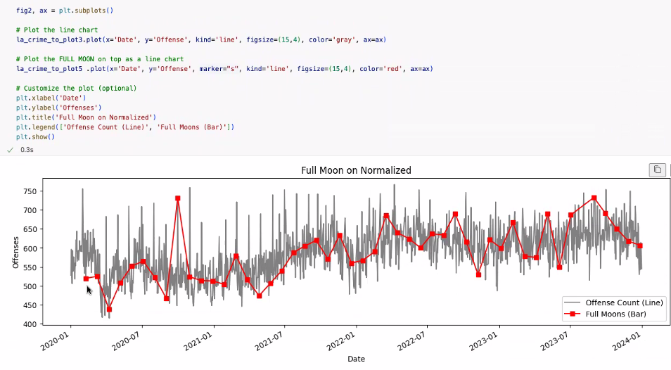
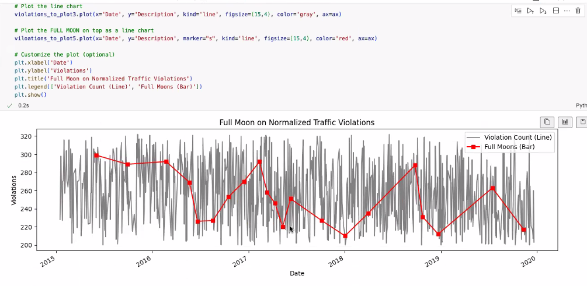
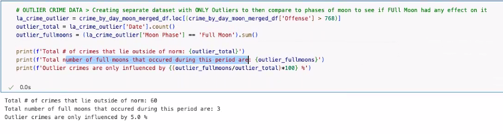
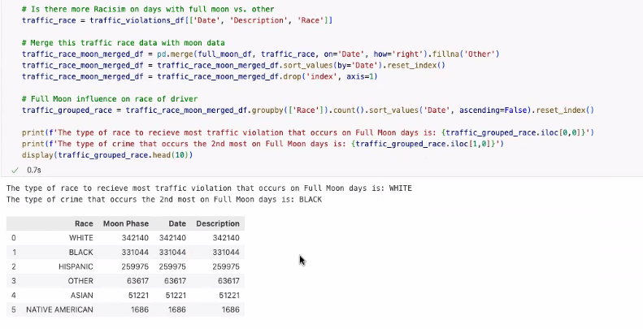

# Lunar Madness

<h1 align = "center" > Lunar Lunacy Effect </h1>
<h3 align = "center" > Fact or Fiction? </h3>
<p align = "center" >
    
    </p>

## Executive Summary  

The **Lunar Madness** project analyzes potential correlations between full moons and crime rates in five U.S. cities. The goal is to leverage public crime statistics and known lunar data to identify patterns that could help organizations optimize staffing and resource allocations. Target clients include local governments, law enforcement agencies, hospitals, and first responders who could benefit from predictive scheduling based on lunar-correlated incident patterns.

Unfortunately, the Null hypothesis proved to be true and we were unable to prove our alternate conclusion. 

## Table of Contents  

- [Project Overview](#project-overview)  
  - [Project Requirements](#project-requirements)  
  - [Data Collection](#data-collection)  
  - [Data Analysis](#data-analysis)
  - [Identify Correlation](#identify-correlation)
- [Findings](#conclusion)
  - [Statistical Significance](#statistical-significance)
  - [Lessons Learned](#lessons-learned)
  - [Next Steps](#next-steps)  
- [Data Sources](#data-sources) 
- [Team Mambers](#team-members)
- [Presentation](#presentation)

## Project Overview  
  
The Lunar Madness project Team is investigating the urban legend that correlates erratic behavior when the moon is in its Full phase. By comparing moon phase data against reported crime and traffic data for multiple major metropolitan cities, the project seeks to determine if there is a statistically significant correlation. If a strong correlation is identified, this preliminay proof of concept could be used as a basis for future investigation.  Businesses and municipalities could benefit from the investigative work of the Lunar Madness Team to help inform optimized staffing levels, fleet preparations, and advising on supply inventories for public departments such as law enforcement, emergency services, and hospitals during specific lunar phases.

## Hypothesis
In research, there are two types of hypotheses: null (H0) and alternative (Ha). They work as a complementary pair, each stating that the other is wrong.

- *Null Hypothesis (H0)* – This can be thought of as the implied hypothesis. “Null” meaning “nothing.”  This hypothesis states that there is no difference between groups or no relationship between variables. The null hypothesis is a presumption of status quo or no change. In our case, H0 = The full moon does not influence behavior, full moon or other moon days will approximately display the same level of erratic behavior.

- *Alternative Hypothesis (Ha)* – This hypothesis should state what we expect the data to show, based on our research on the topic. This is also known as the claim and in our case, Ha = Full moon days will have a higher number of erratic behavior incidents in comparision to other moon days.

Erratic behavior is defined as "unpredictable, irregular, or inconsistent behavior that deviates from what is considered normal. It wan include mood swings, impulsive actions, and exaggerated emotional responses. Crime data and traffic violations datasets were used in our case as close analogies to represent erratic behavior. 

The Lunar Madness team sought to test the validity of the lunar lunacy effect by comparing crime data against full moon dates in 4 major metropolitan cities (Austin, Denver, Houston and Los Angeles) and traffic viloation across the entire the state of Maryland. If our hypothesis is true, we should see a higher volume of erratic behavior incidents, crime and traffic viloations, on days with a full moon.

## Project Requirements

- **Software Requirements:**
  - [Python 3.16 or greater](https://www.python.org/)   
  - [Jupyter Notebook](https://jupyter.org/)
  - GitHub account   
  - Load Dependancies: 
    ```
    import pandas as pd
    from prophet import Prophet
    import datetime as dt
    import numpy as np
    import matplotlib.pyplot as plt
    %matplotlib inline 
    ```
- **GitHub Repository Structure:**
``` Markdown for Clean display of GitHub Repository Structure
  📦Project-1_Lunar_Madness 
      ┣ 📂Michael (Project Notebooks and CSV working files (Austin, Denver, Chicago, LA & Moon))
      ┣ 📂Raymond (Practice & Investigative Jupyter, Notes and test files )
      ┣ 📂Sheila  (Cleand Moon Source file Jupyter Project notebooks, & export CSV) 
      ┣ 📂Zain (Jupyter Project notebooks for )
      ┣ 📂Resources (Data Source files and images for project) 
      ┣ 📜.DS_Store
      ┣ 📜.gitattributes
      ┣ 📜.gitignore
      ┣ 📜Howlers_(Lunar Madness)_Project_Sheet.xlsx
      ┣ 📜LICENSE 
      ┣ 📜README.md 
      ┗ 📜lunar_madness.png
```
- **For Project Files, see:**
    /Zain/lunar_Auto.ipynb
    /Zain/lunar_Crimes.ipynb  
    /Michael/Denver.ipynb
    /Michael/Alt_LA.ipynb
    /Sheila/Houston_Lunar_Data_Sheila.ipynb
    /Sheila/Moon_Data.ipynb
  
## Data Collection 
- (Also See [Data Sources](#data-sources))  
1. Moon phase data collected from the U.S. Naval Observatory and the National Weather Service.  
    - Initial assessment conducted to understand the data and identify any issues
        - Read in each year from 2013-2024 and convert to a new DataFrame
        - Combined into Moon Phase DataFrame to be used for analysis 
        
2. Crime / Incident data cleaned and normalized for the following cities:  
    - Austin
    - Baltimore (Traffic)  
    - Chicago  
    - Denver   
    - Houston  
    - Los Angeles  
3. Moon data merged with the crime data for each city  
Houston Data Sample:


## Data Analysis
- GOAL: Determine if there is a statistically significant correlation between moon phases and crime rates in sampled metropolitan areas (Chicago, Houston, Austin, Denver, Los Angeles, and Traffic in Baltimore)).
- Identify any specific crime types that may be more strongly influenced by the lunar cycle. Explore potential explanations for any observed correlations (e.g., increased visibility during full moon).

- Aggregation Example:  

- Comparison:  


## Visualizations  

- Plot of Los Angeles Crime Data by Day,
  Sliced data for 2020-2024


- Full Moon Normalized


- Full Moon Traffic Normalized


- Outlier Crime Data




## Identify Correlation
No obvious statistical pattern identified.  Mean, Ratios, Statistical, Confidence Interval analyses all indicate a LOW to NO relationship between Erratic Behaviors (Crime & Traffic incidents) and Moon Phases.  Null Hypothesis proved:
Full Moon Crimes / Divided by / Other Moon Phase Crime rates found distinct tendencies towards ‘1.0.’  This indicates there is a LOW correlation in four of the five city/Moon phase datasets (and in the traffic/Moon phase dataset). Permutation tests indicate a 33% chance of erratic incidents when Moon phases are compared.
 


## Findings 
Outside of Denver, CO crime data displayed a hint of a relation (still not strong enough), the majority of our data results proved our H0, or Null, Hypothesis to be proven, i.e. NO RELATIONSHIP EXISTs between Full Moon and Erratic behavior. 
Multiple realtionship measurements were applied (Mean, Ratios, Statistical Significance, CI, P-value) across the dataset and each confirmed Full Moon days are just like any other moon days and do NOT dramatically influence or cause erratic behavior.  In this investigation, there was no significant correlation between in crime or automobile traffic incidents.

While at the higher level the Null Hypothesis proved, our disappointment was used as fuel to investigate deeper to see if any micro-influeces (eg. Type of Crime) were present. This is where we found it quite interesting to see that Murder Rate in Denver, CO was a little bit higher (2% increase) on Full Moon days vs. Other moon days.  Another interesting trend was a marked increase in Tresspassing violations during Full moon phases. 

## Lessons Learned
Obtaining Data that is accurate and reliable early on is important.  Authoratative public data can hold interesting patterns.  Data can have irregularities and data needs to be normalized.  Different types of statistical analyses, graphing and plotting reveal interesting patterns within the data.  Processing data files takes time and diligence to normalize as there are time zone, UTC and formatting issues to overcome.  Communicatiing roles and responsibilities with expected deliverable dates will help on future projects to best utilize resources.  Version control and using github can be a challenge; the .DSstore file from the Apple IOS proved to be problematic and 'dot ignore' file is mandatory at this level of programming.  


## Next Steps:
If a organization, public or private, are willing to sponsor and provide authoratative raw data on local crime, traffic, 911, Emergency rooms and other first responder data, the Lunar Madness Team ("LM") could be contracted to combine the data and further refine this proof of concept template.  The LM framework includes moon phase data, and has several models to plug in local and regional data to uncover statistical correlations.  The Lunar Madness team will scour the data for high correlation events such as crime with other local events or phenomena, research is not limited to just moon phase data.  Set our team to the task of investigating revenue patterns, custom projects, or explore for unidentified trends.  Correlated information that leads to efficient management and can be predicted can make the difference between success vs. surviving.  Let us know the problem you wish to solve and we will do the analysys and presentation for you and your organization.

## Appendix
## Data Sources:
### Full Moon Data Sources:
- [National Weather Service](https://www.weather.gov/box/sunmoon)
 (National Oceanic and Atmospheric Administration)  
Data Points:  Daily moon phase information (e.g., new moon, full moon, first quarter, last quarter, percentage of illumination)  

- [US Naval Observatory Moon Phases](https://aa.usno.navy.mil/calculated/moon/phases?date=2024-01-10&nump=50&format=t&submit=Get+Data)  
Data Points:  Daily moon phase information (e.g., new moon, full moon, first quarter, last quarter)   

### Crime Data Sources:
- [US Government provided data](https://catalog.data.gov/dataset/?tags=crime)  
Data Points: Date and time of each reported crime incident, Crime type  

- [Los Angeles Crime Data](https://data.lacity.org/Public-Safety/Crime-Data-from-2020-to-Present/2nrs-mtv8/about_data)  
Data Points: Date and time of each reported crime incident, Crime type  

- [Houston Crime Data](https://www.kaggle.com/datasets/iamkevin/raw-aggregate-houston-crime-report-data)  
Data Points: Date and time of each reported crime incident, Crime type  

- [Denver Crime Data](https://www.kaggle.com/code/paulo098/denver-crime-data-analysis-and-prediction)  
Data Points: Date and time of each reported crime incident, Crime type  

- [Austin Crime Data](https://catalog.data.gov/dataset/crime-reports-bf2b7)  
Data Points: Date and time of each reported crime incident, Crime type  

### Traffic Data Source
- [Maryland Traffic Data](https://data.montgomerycountymd.gov/Public-Safety/Traffic-Violations/4mse-ku6q/about_data)


## Team Members:  
Data Engineer: Sheila Mathews  
Data Analyst: Raymond Stover  
Data Scientist: Michael Brady  
Data Scientist: Zain Master  

## [Presentation](https://docs.google.com/presentation/d/1stl1fJb9OlSzICY6XXBW35ircUMwCN8yHXWsC-sYAcs/edit?usp=sharing)
