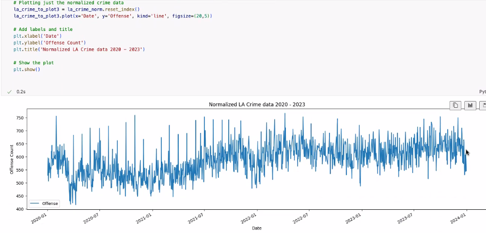
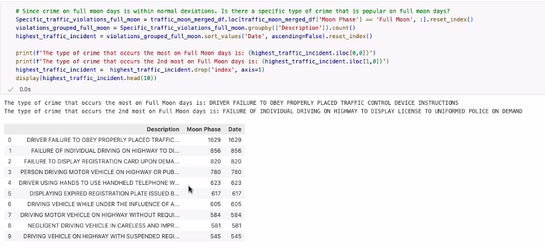

<h1 align = "center" > Lunar Lunacy Effect </h1>
<h3 align = "center" > Fact or Fiction? </h3>

    
    

## Executive Summary  

The **Lunar Madness** project analyzes potential correlations between full moons and crime rates in four U.S. cities. Its goal is to leverage public crime statistics and lunar phase data to identify patterns that could help organizations optimize staffing and resource allocation. Target clients include local governments, law enforcement agencies, hospitals, and first responders who could benefit from predictive scheduling based on lunar-correlated incident patterns.

## Table of Contents  

- [Project Overview](#project-overview)  
  - [Project Requirements](project-requirements)  
  - [Data Collection](#data-collection)  
  - [Data Analysis](#data-analysis)
  - [Identify Correlation](#identify-correlation)
  - [Statistical Significance](#statistical-significance)
- [Conclusion](#conclusion)
  - [Lessons Learned](#lessons-learned)
  - [Next Steps](#next-steps)  
- [Data Sources](#data-sources) 
- [Team Mambers](#team-members)
- [Presentation](#presentation)

## Project Overview  
  
The Lunar Madness project aims to investigate the urban legend that the full moon causes erratic behavior. By comparing moon phase data against reported crime and traffic data for multiple major metropolitan cities, the project seeks to determine if there is a statistically significant correlation. If a strong correlation is identified, this information could be used to optimize staffing levels for public departments such as law enforcement, emergency services, and hospitals during specific lunar phases.

## Project Requirements

- **Software Requirements:**
  - [Python 3.16 or greater](https://www.python.org/)   
  - [Jupyter Notebook](https://jupyter.org/)  
  - Import Dependancies: Pandas, plotly, datetime
  - GitHub Repository

- **GitHub Repository Structure:**
  - Organized, with clear directories for data, code and documentation
  - Branching Strategy: Main Branch only for stable code, individual folders to house work contributions and resources.

## Data Collection
1. **Moon Phase Data:**
   - Collected from the U.S. Naval Observatory and the National Weather Service
   - Data includes daily moon phase information (e.g., new moon, full moon, first quarter, last quarter)
   - Initial assessment conducted to clean and normalize the data for analysis
        - Read in each year from 2013-2024 and convert to a new DataFrame
        - Combined into Moon Phase DataFrame to be used for analysis 
        
        
2. **Crime Data:**
   - cleaned and normalized data (Date, Crime) for the following cities:  
    - Austin  
    - Chicago  
    - Denver   
    - Houston  
    - Los Angeles  
3. ** Merging Data:**
    - Merged moon phase data merged with crime data for each city using a right join on the date column
    - Aggregated total counts of crime for each date  
Houston

## Data Analysis

- **Key Questions:**
  1. Is there a statistically significant correlation between moon phases and crime rates in sampled cities?
  2. Which crime type, if any, are influenced by the lunar cycle?

- **Statistical Analysis:**
- Aggregation:  

- Grouping:  

- Comparison:  

- Aggregated total count of crimes that occurred on each date

- Correlation, summary statistics and time series analysis applied to identify trends.
- Specific focus on determining if any crime types are more strongly influenced by the lunar cycle.

- Outliers:  
  

## Visualizations

- Multiple visualizations were created to support findings
1. Example of normalized crime data

2. Plot of Los Angeles Crime Data by Day
Sliced data for 2020-2024

Outlier crime data: 

2.Full Moon Data Normalized  

No pattern identified

## Conclusion:

## Lessons Learned:
- Challenges converting to datetime with UTC time led to the adoption of `.dt.date` for preprocessing.  

- Improved understanding of version control and branching strategies.
- Importance of defining roles to prevent duplication and confusion during analysis.

## Next Steps:
- Expand the dataset to include additional cities and years.
- Explore machine learning techniques for predictive modeling.
- Refine the methodology for merging and analyzing large datasets.

## Appendix

 ## Data Sources:
### Full Moon Data Sources:
- [National Weather Service](https://www.weather.gov/box/sunmoon)
 (National Oceanic and Atmospheric Administration)  
Data Points:  Daily moon phase information (e.g., new moon, full moon, first quarter, last quarter, percentage of illumination)  

- [US Naval Observatory Moon Phases](https://aa.usno.navy.mil/calculated/moon/phases?date=2024-01-10&nump=50&format=t&submit=Get+Data)  
Data Points:  Daily moon phase information (e.g., new moon, full moon, first quarter, last quarter)   

### Crime Data Sources:
- [US Government provided data](https://catalog.data.gov/dataset/?tags=crime)  
Data Points: Date and time of each reported crime incident, Crime type  

- [Los Angeles Crime Data](https://data.lacity.org/Public-Safety/Crime-Data-from-2020-to-Present/2nrs-mtv8/about_data)  
Data Points: Date and time of each reported crime incident, Crime type  

- [Houston Crime Data](https://www.kaggle.com/datasets/iamkevin/raw-aggregate-houston-crime-report-data)  
Data Points: Date and time of each reported crime incident, Crime type  

- [Denver Crime Data](https://www.kaggle.com/code/paulo098/denver-crime-data-analysis-and-prediction)  
Data Points: Date and time of each reported crime incident, Crime type  

- [Austin Crime Data](https://catalog.data.gov/dataset/crime-reports-bf2b7)  
Data Points: Date and time of each reported crime incident, Crime type  

### Traffic Data Source
- [Maryland Traffic Data](https://data.montgomerycountymd.gov/Public-Safety/Traffic-Violations/4mse-ku6q/about_data)

## Team Members: (add images)
Data Engineer: Sheila Mathews  
Data Analyst: Raymond Stover  
Data Scientist: Michael Brady  
Data Scientist: Zain Master  

## [Presentation](https://docs.google.com/presentation/d/1stl1fJb9OlSzICY6XXBW35ircUMwCN8yHXWsC-sYAcs/edit?usp=sharing)
